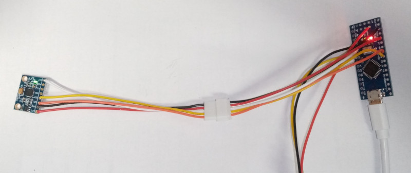

This is a test of MPU6050 performance - visualizing its movement by rotating 3D model
on the screen as shown in the webpage.

https://www.youtube.com/watch?v=XhT9lw_JC04

This program connects to Arduino (Arduino program source in arduino/test_mpu6050) and retrieves
the Yaw, Pitch, Roll values periodically as provided by the MPU6050 in 6DOF mode 
(MPU6050_6Axis_MotionApps_V6_12), the Arduino code is directly adapted from the 
standard Arduino MPU6050 library (from Electronic Cats, ver. 0.5.0) example.

At the same time it provides a very simple webserver on port 8002, through which
it is possible to open a page http://localhost:8002/gyro.html, which loads "plane.glb"
dynamic model using Google's library and emits ajax requests to that server to 
retrieve the YPR values 10 times per second, and then rotates the model based
on the movements of the mpu gyro. 

Done in January 2022 as part of a student project to control Nico hand by home-made VR glove.
It is just a dirty small example.

contact: Pavel, pavel.petrovic at uniba.sk.
